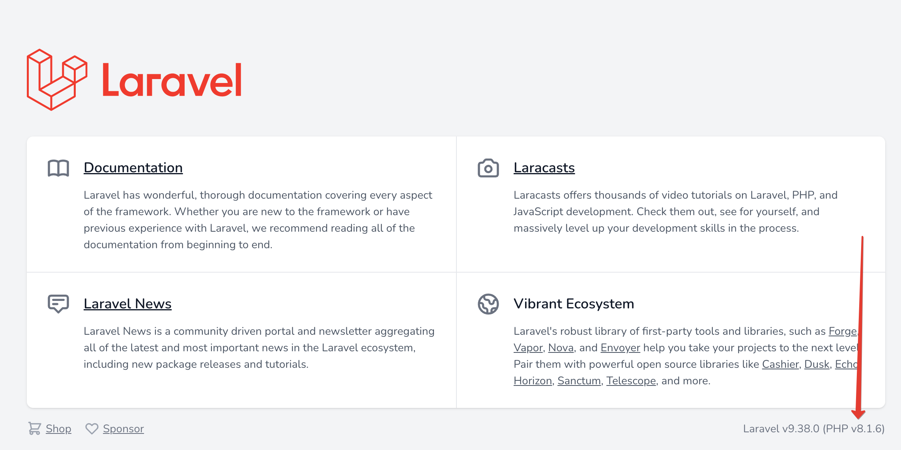

# Этап 6 - Актуализация версии PHP в composer.json

Открыть главную страницу приложения - localhost:8080.

Узнать текущую версию PHP:


Актуализировать версию PHP в `composer.json`:
```
composer require php:^8.1.6
```
