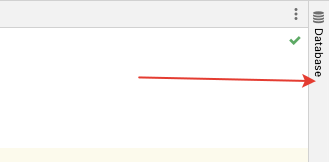
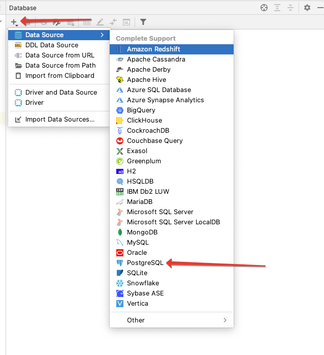
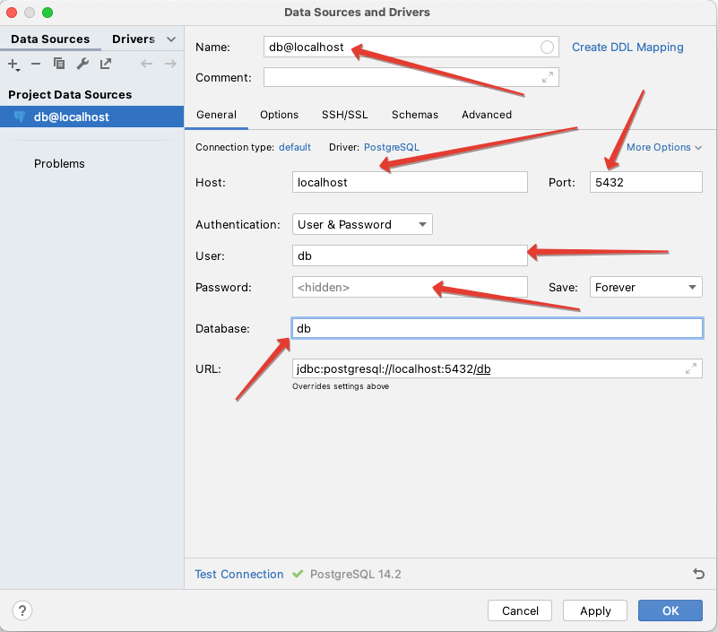
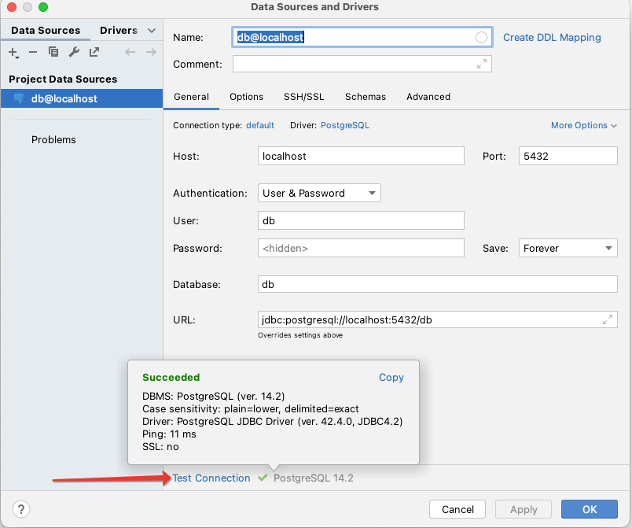
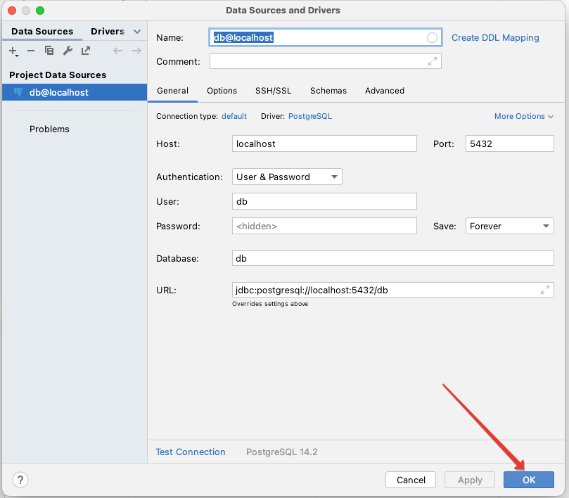

# Этап 14 - Доступ к БД через PHPStorm

Для более удобного просмотра таблиц БД можно добавить их в PHPStorm.

- Открыть панель **Database**:

- Добавить новую БД PostgreSQL:

- Заполнить настройки для БД (пароль и всё остальное можно посмотреть в `docker-compose.yml` для контейнера `db`):

- Можно протестировать подключение:

- И затем сохранить настройки:

- Тоже самое повторить для БД с данными **Laravel Telescope** - `db-telescope`.
